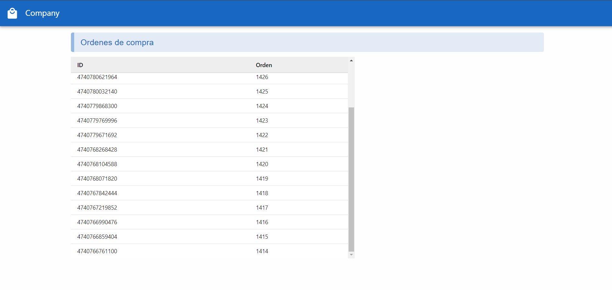
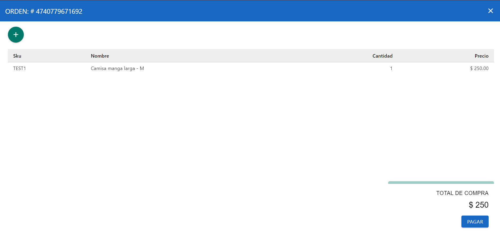

# Prueba técnica | orden de compra

Realiza una interfaz de usuario con un diseño que tenga buena usabilidad para obtener la información de la orden de compra


## Project Setup

### Version node
* Install Node.js version 18.0 

```sh
npm install
```

### Compile for Development

```sh
npm run dev
```

### Compile and Minify for Production

```sh
npm run build
```

### Lint with [ESLint](https://eslint.org/)

```sh
npm run lint
```

### Project image



